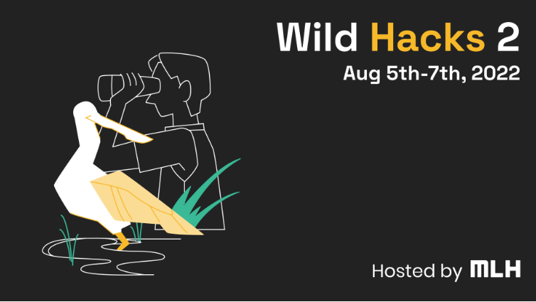
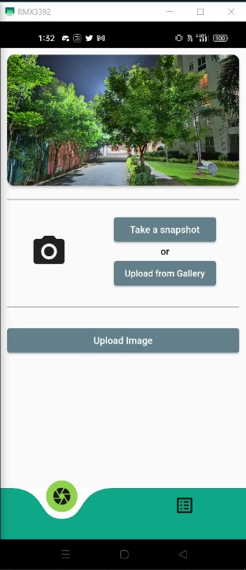

### Wild Hacks2

Official submission to Wild Hacks 2 organised by MLH 2022. 

Check out the project video here - [YouTube]()

## Inspiration💡

In case you're a full time farmer or the ocasional home gardener, We're sure that you might have come across some form of spots or marks on the plants or their leaves. It's worrying to not know as to how a disease might be affecting the plant growth in your specific case. After it, you go on the internet to search about the problem that you might be encountering, but the answers you receive are more or less not very accurate. 

Vegitation is vastly affected in terms of it's growth and the fruits it prospers due to the lack of awareness in terms of plant diseases. 

Our solution was to build an open cv project, that you could easily use on your mobile application in order to identify plant diseases to a high degree of accuracy. 

## What it does 🧭

The landing page of the application presents you with two tabs, in the first, you can click an image or upload an image from your gallery to identify the plant disease. Once the image is captured it is processed by our ML backend which sends the result back to the client-side application. The communication between the Model and the client app is handled by flask. 

## How the App Looks 🤜🔥🤛

## How we built it 🔧

Our solution, was built with ❤️ using Flutter, Python, Machine learning Algorithms and image Recognition. Special Mention to Git and GitHub for providing us with the tools we needed to collaborate in real time whilst working from different regions. 

## Tech Stack 🔨
1. Flutter
2. Dart
3. Python
4. Machine Learning
5. Voice Recognition
6. Git
7. Github
8. Flask

## Challenges we ran into 🏃‍♂️

1. Integration of the ML model with a flutter application was challenging to say the least. 

## Accomplishments that we're proud of 🏅
1. The flutter app has an user friendly UI and UX.
2. The ML model gives us an accuracy of over 90% which is very acceptable without over-fitting.

## What we learned 🧠
1. Image processing using Machine learning
2. Integration of ML models with flutter
## What's next ⏭
 1. Improve Flask integration.

## Collaborators 🤖

Some beep-bops some developers. 

| Name      | GitHub Profile     |
| :------------- | :----------: |
|  Gyanesh Samanta   | [GitHub](https://www.github.com/gyanesh-samanta-123) |
|  Eshaan Bhardwaj   | [GitHub](https://github.com/Eshaan-B) |
|  Adarsh Sailendra   | [GitHub](https://github.com/Adarsh-gif-crypt) |

